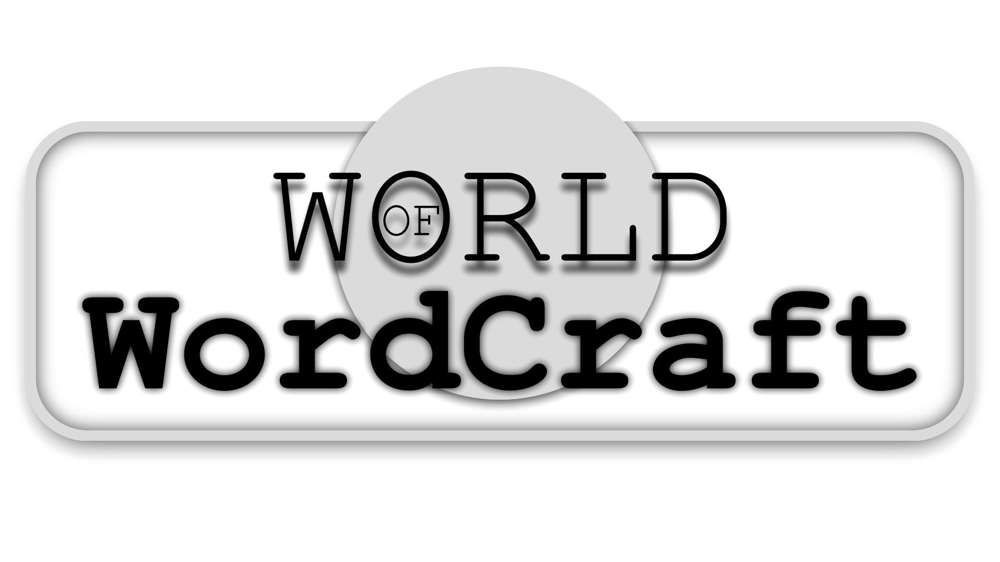

# World Of Wordcraft


> a word generator based on an input dictionary and occurrence statistics *(machine learning du pauvre)*

---
To compile and start it
```bash
./cmakecompile.sh

build/wow -h
# build/wow <mode=char|word> <source_file> <output_file> <number_of_generations> [context_size] [end_ratio] [chaos] [context_variation] [seriousness]
# MANDATORY ARGUMENTS:
#   mode: 'char' or 'word'        -- learned tokens
#   source_file: path/to/file     -- input file to learn
#   output_file: path/to/file     -- output file containing generated
#   number_of_generations: int 1+ -- number of generated lines
#   
# OPTIONAL ARGUMENTS:
#   context_size:      int   1;inf   -- statistics context to choose next token (1: only depends on last char, inf: overfit training)
#   end_ratio:         float 0.;1.   -- probability to end the line (0: biggest lines, 1 smallest lines)
#   chaos:             float -inf;1. -- probability of tokens ponderation (1: equiprobability, 0: natural, -: amplified)
#   context_variation: int   0;cs    -- randomly reduce size of context (0: constant context size, cs=context_size: sometimes no context for next token)
#   seriousness:       int   0;inf   -- ponderation of variations cs^srx (0: all variations equiprobable, inf: bigger chances to have a big context)h

build/wow char ../../c/commonphrases.txt data/pOut 100 10 0.2 0.3 0 2
build/wow word ../../c/commonphrases.txt data/pOut 100 2 0.5 0.0 0 2
```